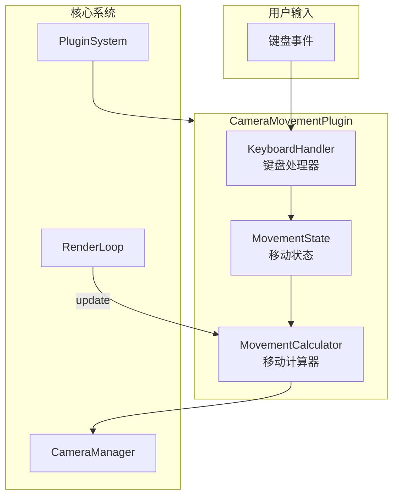
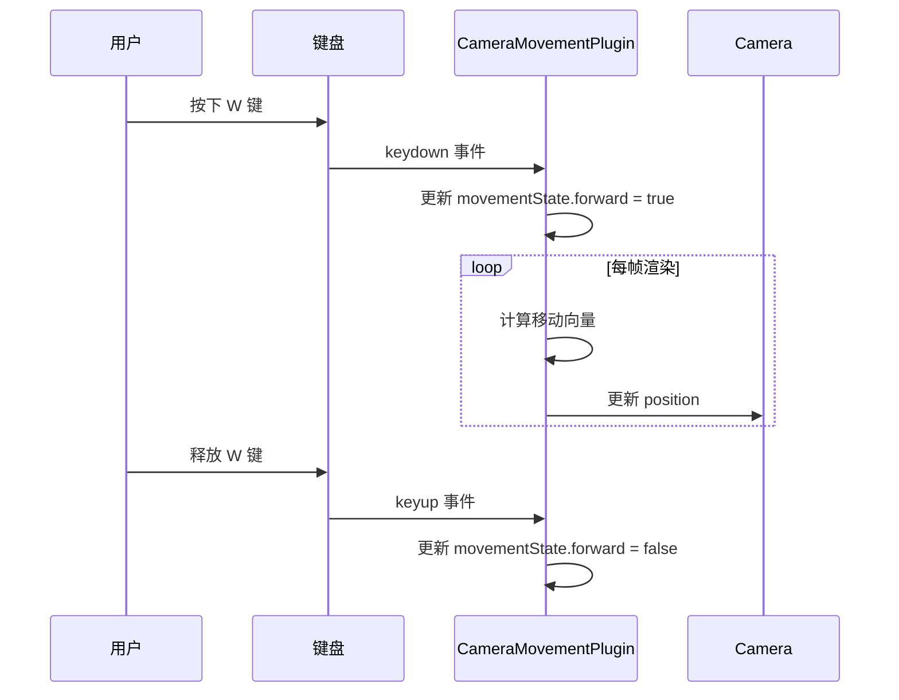

# 设计文档

## 概述

本设计文档描述了 Camera Movement Control 功能的技术实现方案。该功能通过创建一个新的插件 `CameraMovementPlugin`，为 Three.js 查看器添加键盘控制的相机移动能力。

插件遵循现有的插件架构模式，与 `OrbitControlsPlugin` 协同工作，提供完整的相机控制体验。

## 架构

### 系统架构图



### 数据流



## 组件与接口

### CameraMovementPlugin 接口

```typescript
/**
 * 相机移动插件配置选项
 */
export interface CameraMovementConfig {
  /** 基础移动速度，默认 5.0 */
  moveSpeed?: number;
  /** 是否启用移动控制，默认 true */
  enabled?: boolean;
}

/**
 * 相机移动插件公共接口
 */
export interface ICameraMovementPlugin extends Plugin {
  /** 插件名称 */
  readonly name: string;
  
  /**
   * 配置插件
   * @param config 配置选项
   */
  configure(config: CameraMovementConfig): void;
  
  /**
   * 设置是否启用移动控制
   * @param enabled 是否启用
   */
  setEnabled(enabled: boolean): void;
  
  /**
   * 获取当前启用状态
   * @returns 是否启用
   */
  isEnabled(): boolean;
  
  /**
   * 设置移动速度
   * @param speed 移动速度
   */
  setMoveSpeed(speed: number): void;
  
  /**
   * 获取当前移动速度
   * @returns 移动速度
   */
  getMoveSpeed(): number;
  
  /**
   * 检查当前是否正在移动
   * @returns 是否正在移动
   */
  isMoving(): boolean;
}
```

### 键盘映射

```typescript
/**
 * 移动方向枚举
 */
export enum MovementDirection {
  FORWARD = 'forward',   // W 键
  BACKWARD = 'backward', // S 键
  LEFT = 'left',         // A 键
  RIGHT = 'right',       // D 键
  UP = 'up',             // Shift 键
  DOWN = 'down'          // Ctrl 键
}

/**
 * 键盘到移动方向的映射
 */
const KEY_MAPPING: Record<string, MovementDirection> = {
  'KeyW': MovementDirection.FORWARD,
  'KeyS': MovementDirection.BACKWARD,
  'KeyA': MovementDirection.LEFT,
  'KeyD': MovementDirection.RIGHT,
  'ShiftLeft': MovementDirection.UP,
  'ShiftRight': MovementDirection.UP,
  'ControlLeft': MovementDirection.DOWN,
  'ControlRight': MovementDirection.DOWN
};
```

## 数据模型

### 移动状态

```typescript
/**
 * 移动状态，记录当前按下的移动键
 */
interface MovementState {
  forward: boolean;   // W 键状态
  backward: boolean;  // S 键状态
  left: boolean;      // A 键状态
  right: boolean;     // D 键状态
  up: boolean;        // Shift 键状态
  down: boolean;      // Ctrl 键状态
}
```

### 移动向量计算

移动向量的计算基于相机的当前朝向：

1. **水平移动（WASD）**：
   - 获取相机的前向量（forward vector）
   - 将前向量投影到水平面（Y=0），得到水平前向量
   - 通过叉积计算右向量
   - 根据按键状态组合移动向量

2. **垂直移动（Shift/Ctrl）**：
   - 直接使用世界坐标系的 Y 轴方向

```typescript
// 伪代码：移动向量计算
function calculateMovementVector(camera: Camera, state: MovementState): Vector3 {
  const movement = new Vector3(0, 0, 0);
  
  // 获取相机前向量并投影到水平面
  const forward = camera.getWorldDirection(new Vector3());
  forward.y = 0;
  forward.normalize();
  
  // 计算右向量
  const right = new Vector3();
  right.crossVectors(forward, new Vector3(0, 1, 0));
  
  // 水平移动
  if (state.forward) movement.add(forward);
  if (state.backward) movement.sub(forward);
  if (state.right) movement.add(right);
  if (state.left) movement.sub(right);
  
  // 垂直移动
  if (state.up) movement.y += 1;
  if (state.down) movement.y -= 1;
  
  // 归一化并应用速度
  if (movement.length() > 0) {
    movement.normalize();
  }
  
  return movement;
}
```

## 正确性属性

*正确性属性是描述系统在所有有效执行中应保持为真的特征或行为。属性作为人类可读规范与机器可验证正确性保证之间的桥梁。*

### Property 1: 方向键产生正确的移动方向

*对于任意*相机朝向和任意单个方向键输入，计算出的移动向量应满足：
- W/S键：移动向量在水平面内（Y分量为0），且与相机前向量的水平投影平行
- A/D键：移动向量在水平面内（Y分量为0），且与相机右向量平行
- Shift键：移动向量仅有正Y分量
- Ctrl键：移动向量仅有负Y分量

**Validates: Requirements 1.1, 1.2, 1.3, 1.4, 1.5, 1.6**

### Property 2: 多键向量叠加

*对于任意*按键组合，最终移动向量应等于各单独方向向量的归一化和。即：
`normalize(sum(individual_vectors)) == final_movement_direction`

**Validates: Requirements 1.7**

### Property 3: 无按键时停止移动

*对于任意*移动状态，当所有方向键状态均为false时，计算出的移动向量应为零向量。

**Validates: Requirements 1.8**

### Property 4: enabled状态控制输入响应

*对于任意*按键输入和enabled状态：
- 当enabled为false时，无论按下什么键，移动向量始终为零
- 当enabled为true时，按下有效移动键会产生非零移动向量

**Validates: Requirements 2.2, 2.3**

### Property 5: 移动距离与deltaTime成正比

*对于任意*正数deltaTime和moveSpeed，实际移动距离应等于 `moveSpeed * deltaTime * direction.length()`，其中direction为归一化的移动方向向量。

**Validates: Requirements 3.3**

### Property 6: update方法更新相机位置

*对于任意*有效的移动状态（至少一个方向键为true）和正数deltaTime，调用update方法后相机位置应发生变化，且变化方向与计算的移动向量一致。

**Validates: Requirements 4.4**

### Property 7: isMoving状态一致性

*对于任意*移动状态，isMoving()的返回值应与"至少有一个方向键被按下"的状态一致。

**Validates: Requirements 5.4**

## 错误处理

### 插件生命周期错误

| 错误场景 | 处理方式 |
|---------|---------|
| 在dispose后调用方法 | 抛出 Error: 'CameraMovementPlugin has been disposed' |
| 在initialize前调用配置方法 | 抛出 Error: 'CameraMovementPlugin has not been initialized' |
| 设置负数移动速度 | 使用绝对值或抛出警告并使用默认值 |

### 键盘事件错误

| 错误场景 | 处理方式 |
|---------|---------|
| 容器元素不支持键盘事件 | 在容器上设置 tabIndex 使其可聚焦 |
| 事件监听器添加失败 | 记录错误日志，插件降级为禁用状态 |

## 测试策略

### 单元测试

单元测试用于验证具体示例和边界情况：

1. **初始化测试**
   - 验证默认配置值（enabled=true, moveSpeed=5.0）
   - 验证自定义配置正确应用

2. **API测试**
   - 验证 setEnabled/isEnabled 方法
   - 验证 setMoveSpeed/getMoveSpeed 方法
   - 验证 isMoving 方法

3. **生命周期测试**
   - 验证 initialize 添加事件监听器
   - 验证 dispose 移除事件监听器
   - 验证 dispose 后方法抛出错误

### 属性测试

属性测试使用 fast-check 库验证普遍属性：

**配置要求**：
- 每个属性测试至少运行 100 次迭代
- 每个测试需标注对应的设计属性
- 标注格式：**Feature: camera-movement-control, Property {number}: {property_text}**

**测试实现**：

1. **Property 1 测试**：生成随机相机朝向，验证各方向键产生正确的移动方向
2. **Property 2 测试**：生成随机按键组合，验证向量叠加正确性
3. **Property 3 测试**：验证空移动状态产生零向量
4. **Property 4 测试**：生成随机enabled状态和按键，验证响应正确性
5. **Property 5 测试**：生成随机deltaTime和speed，验证移动距离比例
6. **Property 6 测试**：生成随机移动状态，验证update更新相机位置
7. **Property 7 测试**：生成随机移动状态，验证isMoving一致性

### 集成测试

1. **与OrbitControls协同测试**
   - 验证两个插件可以同时工作
   - 验证移动后OrbitControls的target不受影响

2. **Demo应用测试**
   - 验证开关控件正确控制插件状态
   - 验证速度滑块正确调整移动速度

