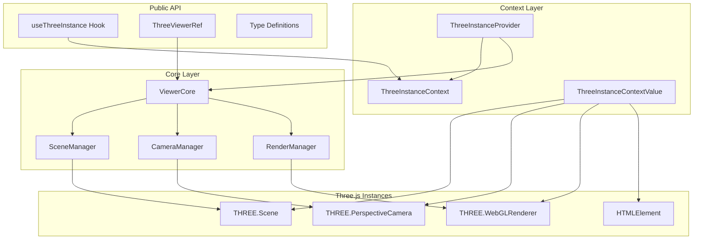

# Design Document: Three.js Instance Access API

## Overview

本设计文档描述了 Three.js 实例访问 API 的技术架构。该 API 允许开发者通过两种方式访问底层 Three.js 实例：

1. **React Hook 方式** (`useThreeInstance`) - 适用于需要响应式更新的场景
2. **React Ref 方式** - 适用于命令式操作，不触发重渲染

核心设计原则：
- **安全访问**: 生命周期感知，在无效状态下返回 null
- **类型安全**: 完整的 TypeScript 类型定义
- **最小侵入**: 不修改现有 ViewerCore 架构
- **React 惯例**: 遵循 React Context 和 Ref 的最佳实践

## Architecture



## Components and Interfaces

### ThreeInstanceContextValue

Context 提供的值类型，包含所有可访问的 Three.js 实例。

```typescript
interface ThreeInstanceContextValue {
  /** Three.js Scene 实例，未初始化时为 null */
  scene: THREE.Scene | null;
  /** Three.js PerspectiveCamera 实例，未初始化时为 null */
  camera: THREE.PerspectiveCamera | null;
  /** Three.js WebGLRenderer 实例，未初始化时为 null */
  renderer: THREE.WebGLRenderer | null;
  /** 容器 DOM 元素，未初始化时为 null */
  container: HTMLElement | null;
  /** Viewer 是否已初始化并准备就绪 */
  isReady: boolean;
  /** Viewer 是否已被销毁 */
  isDisposed: boolean;
}
```

### ThreeViewerHandle

通过 Ref 暴露的命令式 API。

```typescript
interface ThreeViewerHandle {
  /** 获取所有 Three.js 实例 */
  getInstances(): ThreeInstanceContextValue;
  /** 获取 ViewerCore 实例，用于高级操作 */
  getViewerCore(): ViewerCore | null;
  /** 检查 Viewer 是否已准备就绪 */
  isReady(): boolean;
  /** 检查 Viewer 是否已被销毁 */
  isDisposed(): boolean;
}
```

### useThreeInstance Hook

React Hook，用于在组件中访问 Three.js 实例。

```typescript
/**
 * 获取 Three.js 实例的 React Hook
 * 
 * @returns ThreeInstanceContextValue 包含所有 Three.js 实例的上下文值
 * @throws Error 如果在 ThreeViewer 组件外部调用
 * 
 * @example
 * ```tsx
 * function MyComponent() {
 *   const { scene, camera, isReady } = useThreeInstance();
 *   
 *   useEffect(() => {
 *     if (isReady && scene) {
 *       // 添加自定义对象到场景
 *       const light = new THREE.PointLight(0xffffff);
 *       scene.add(light);
 *     }
 *   }, [scene, isReady]);
 *   
 *   return null;
 * }
 * ```
 */
function useThreeInstance(): ThreeInstanceContextValue;
```

### ThreeInstanceProvider

内部 Context Provider 组件。

```typescript
interface ThreeInstanceProviderProps {
  children: React.ReactNode;
  viewerCore: ViewerCore | null;
}

/**
 * 内部 Provider 组件，由 ThreeViewer 自动包装
 * 不需要用户手动使用
 */
function ThreeInstanceProvider(props: ThreeInstanceProviderProps): JSX.Element;
```

### Updated ThreeViewerProps

扩展后的 ThreeViewer props，支持 ref。

```typescript
interface ThreeViewerProps {
  // ... 现有 props 保持不变
  modelUrl?: string;
  pivotPoint?: { x: number; y: number; z: number };
  zoomLimits?: ZoomLimits;
  className?: string;
  style?: React.CSSProperties;
  onLoad?: (result: ModelLoadResult) => void;
  onError?: (error: Error) => void;
  onLoadingChange?: (isLoading: boolean) => void;
  /** 子组件，可以使用 useThreeInstance Hook */
  children?: React.ReactNode;
}

// ThreeViewer 现在支持 forwardRef
const ThreeViewer: React.ForwardRefExoticComponent<
  ThreeViewerProps & React.RefAttributes<ThreeViewerHandle>
>;
```

## Data Models

### Context State Management

Context 状态的内部管理逻辑。

```typescript
// 初始状态
const initialContextValue: ThreeInstanceContextValue = {
  scene: null,
  camera: null,
  renderer: null,
  container: null,
  isReady: false,
  isDisposed: false,
};

// 状态更新时机
enum ContextUpdateTrigger {
  VIEWER_INITIALIZED = 'VIEWER_INITIALIZED',
  VIEWER_DISPOSED = 'VIEWER_DISPOSED',
}
```

### Type Exports

导出的类型定义。

```typescript
// 从 index.ts 导出
export type {
  ThreeInstanceContextValue,
  ThreeViewerHandle,
  ThreeViewerProps,
  // 现有类型继续导出
  ModelLoadResult,
  ZoomLimits,
};

export {
  ThreeViewer,
  useThreeInstance,
};
```


## Correctness Properties

*A property is a characteristic or behavior that should hold true across all valid executions of a system—essentially, a formal statement about what the system should do. Properties serve as the bridge between human-readable specifications and machine-verifiable correctness guarantees.*

### Property 1: Instance Identity Consistency

*For any* initialized ThreeViewer, the instances returned by the Instance_Accessor (scene, camera, renderer, container) SHALL be the exact same object references as the internal ViewerCore instances.

**Validates: Requirements 1.1, 1.2, 1.3, 1.4**

### Property 2: Hook Context Correctness

*For any* component rendered within a ThreeViewer, calling useThreeInstance SHALL return a context object where all non-null instances match the ViewerCore's internal instances.

**Validates: Requirements 2.2, 2.4**

### Property 3: Ref API Correctness

*For any* ThreeViewer with a ref attached, calling getInstances() SHALL return the same instance references as useThreeInstance, and getViewerCore() SHALL return the actual ViewerCore instance.

**Validates: Requirements 3.2, 3.3**

### Property 4: Lifecycle State Tracking

*For any* ThreeViewer lifecycle transition (mount → initialize → dispose), the isReady and isDisposed flags SHALL accurately reflect the current state: isReady=true only when initialized and not disposed, isDisposed=true only after disposal.

**Validates: Requirements 4.1, 4.3, 4.5**

### Property 5: Safe Null Handling

*For any* ThreeViewer in an invalid state (not initialized or disposed), all instance accessors SHALL return null without throwing errors, and the isReady flag SHALL be false.

**Validates: Requirements 1.5, 1.6, 4.2, 4.4**

### Property 6: Backward Compatibility

*For any* ThreeViewer usage that does not use the new instance access API (no ref, no useThreeInstance, no children), the component behavior SHALL be identical to the previous version, including all callback invocations.

**Validates: Requirements 6.2, 6.5**

## Error Handling

### Hook Usage Errors

| Error Condition | Handling Strategy | User Feedback |
|----------------|-------------------|---------------|
| useThreeInstance called outside ThreeViewer | Throw descriptive error | Error message: "useThreeInstance must be used within a ThreeViewer component" |
| Accessing instances before initialization | Return null | isReady flag is false, instances are null |
| Accessing instances after disposal | Return null | isDisposed flag is true, instances are null |

### Ref Usage Errors

| Error Condition | Handling Strategy | User Feedback |
|----------------|-------------------|---------------|
| Calling ref methods before mount | Return null | Methods return null safely |
| Calling ref methods after unmount | Return null | Methods return null safely |
| Invalid ref type passed | TypeScript compile error | Type error at compile time |

### State Transition Safety

```typescript
// State machine for lifecycle
type LifecycleState = 'unmounted' | 'mounted' | 'initialized' | 'disposed';

// Valid transitions
const validTransitions: Record<LifecycleState, LifecycleState[]> = {
  unmounted: ['mounted'],
  mounted: ['initialized', 'disposed'],
  initialized: ['disposed'],
  disposed: [], // Terminal state
};

// Instance availability by state
const instanceAvailability: Record<LifecycleState, boolean> = {
  unmounted: false,
  mounted: false,
  initialized: true,
  disposed: false,
};
```

## Testing Strategy

### Unit Tests

Unit tests focus on specific examples and edge cases:

1. **useThreeInstance Hook Tests**
   - Returns correct context when inside ThreeViewer
   - Throws error when outside ThreeViewer
   - Updates when context changes

2. **ThreeViewerHandle Ref Tests**
   - getInstances returns correct values
   - getViewerCore returns ViewerCore instance
   - isReady and isDisposed return correct states

3. **ThreeInstanceProvider Tests**
   - Provides correct context to children
   - Updates context on viewer state changes

4. **Backward Compatibility Tests**
   - Existing props work unchanged
   - Callbacks still fire correctly
   - No ref usage doesn't break component

### Property-Based Tests

Property-based tests verify universal properties across many generated inputs. Each property test should run a minimum of 100 iterations.

**Testing Framework**: Vitest with @testing-library/react for React component testing

**Test Configuration**:
```typescript
import { fc } from '@fast-check/vitest';

// Minimum 100 iterations per property test
const propertyConfig = { numRuns: 100 };
```

**Property Test Implementation**:

1. **Property 1: Instance Identity Consistency**
   - Generate random initialization configurations
   - Verify all returned instances are identical references
   - Tag: `Feature: threejs-instance-access, Property 1: Instance Identity Consistency`

2. **Property 4: Lifecycle State Tracking**
   - Generate random sequences of lifecycle operations
   - Verify isReady and isDisposed flags are always correct
   - Tag: `Feature: threejs-instance-access, Property 4: Lifecycle State Tracking`

3. **Property 5: Safe Null Handling**
   - Generate random access patterns in invalid states
   - Verify no errors thrown and null returned
   - Tag: `Feature: threejs-instance-access, Property 5: Safe Null Handling`

4. **Property 6: Backward Compatibility**
   - Generate random prop combinations (without new API)
   - Verify behavior matches original implementation
   - Tag: `Feature: threejs-instance-access, Property 6: Backward Compatibility`

### Integration Tests

1. **Full Hook Usage Flow**
   - Mount ThreeViewer with children using useThreeInstance
   - Verify instances are accessible
   - Verify updates on state changes
   - Verify cleanup on unmount

2. **Full Ref Usage Flow**
   - Mount ThreeViewer with ref
   - Call all ref methods
   - Verify correct return values
   - Verify cleanup on unmount

3. **Combined Usage**
   - Use both Hook and Ref simultaneously
   - Verify consistency between both APIs

### Test File Structure

```
src/
├── hooks/
│   ├── __tests__/
│   │   └── useThreeInstance.test.tsx
├── context/
│   ├── __tests__/
│   │   └── ThreeInstanceContext.test.tsx
├── components/
│   ├── __tests__/
│   │   └── ThreeViewer.ref.test.tsx
└── __tests__/
    ├── properties/
    │   ├── instanceIdentity.property.test.ts
    │   ├── lifecycleState.property.test.ts
    │   ├── safeNullHandling.property.test.ts
    │   └── backwardCompatibility.property.test.ts
    └── integration/
        └── instanceAccess.integration.test.tsx
```
