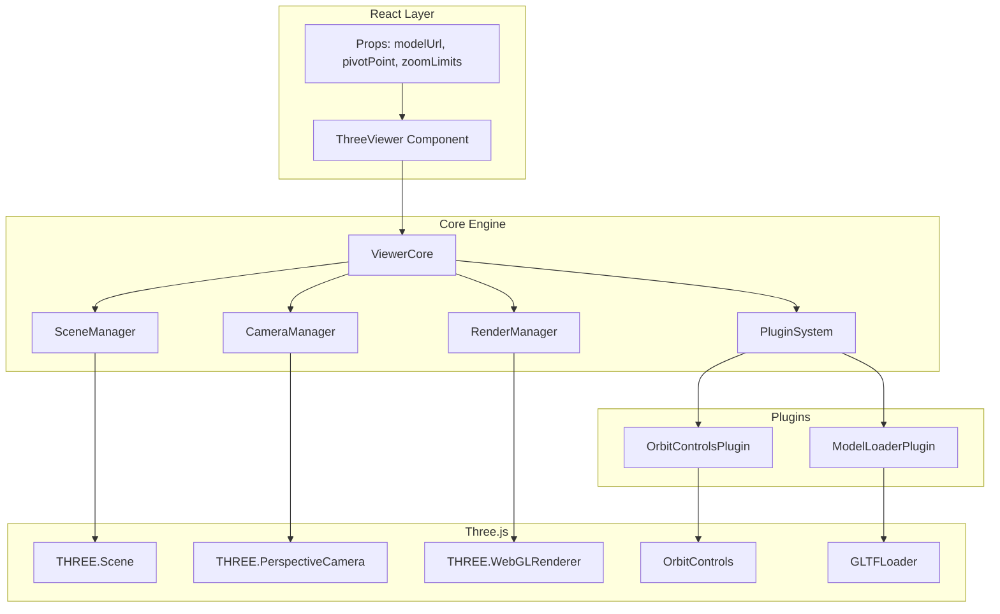

# Design Document: Three.js Viewer

## Overview

本设计文档描述了一个模块化的 Three.js 3D 模型查看器的技术架构。该查看器作为 React 组件对外导出，支持 GLTF 模型加载和轨道视角控制。架构采用插件系统设计，便于后续功能扩展。

核心设计原则：
- **关注点分离**: 将场景管理、相机控制、模型加载、渲染循环分离为独立模块
- **可扩展性**: 通过插件系统支持功能扩展
- **React 集成**: 提供符合 React 习惯的组件 API
- **资源管理**: 确保 Three.js 资源的正确创建和销毁

## Architecture



## Components and Interfaces

### ViewerCore

核心引擎类，协调所有子系统。

```typescript
interface ViewerCoreOptions {
  container: HTMLElement;
  antialias?: boolean;
  alpha?: boolean;
}

interface ViewerCore {
  readonly scene: SceneManager;
  readonly camera: CameraManager;
  readonly renderer: RenderManager;
  readonly plugins: PluginSystem;
  
  initialize(options: ViewerCoreOptions): void;
  start(): void;
  stop(): void;
  dispose(): void;
  resize(width: number, height: number): void;
}
```

### SceneManager

场景管理器，负责 Three.js Scene 的创建和管理。

```typescript
interface SceneManager {
  readonly scene: THREE.Scene;
  
  add(object: THREE.Object3D): void;
  remove(object: THREE.Object3D): void;
  clear(): void;
  dispose(): void;
}
```

### CameraManager

相机管理器，负责相机的创建、配置和更新。

```typescript
interface CameraConfig {
  fov?: number;
  near?: number;
  far?: number;
  position?: THREE.Vector3;
}

interface CameraManager {
  readonly camera: THREE.PerspectiveCamera;
  
  configure(config: CameraConfig): void;
  setAspect(aspect: number): void;
  lookAt(target: THREE.Vector3): void;
  dispose(): void;
}
```

### RenderManager

渲染管理器，负责 WebGL 渲染器和渲染循环。

```typescript
interface RenderManagerOptions {
  antialias?: boolean;
  alpha?: boolean;
}

interface RenderManager {
  readonly renderer: THREE.WebGLRenderer;
  
  initialize(container: HTMLElement, options?: RenderManagerOptions): void;
  setSize(width: number, height: number): void;
  render(scene: THREE.Scene, camera: THREE.Camera): void;
  dispose(): void;
}
```

### PluginSystem

插件系统，管理功能插件的注册、生命周期和通信。

```typescript
interface PluginContext {
  scene: THREE.Scene;
  camera: THREE.PerspectiveCamera;
  renderer: THREE.WebGLRenderer;
  container: HTMLElement;
}

interface Plugin {
  readonly name: string;
  
  initialize(context: PluginContext): void;
  update?(deltaTime: number): void;
  dispose(): void;
}

interface PluginSystem {
  register(plugin: Plugin): void;
  unregister(pluginName: string): void;
  get<T extends Plugin>(pluginName: string): T | undefined;
  updateAll(deltaTime: number): void;
  disposeAll(): void;
}
```

### ModelLoaderPlugin

模型加载插件，负责 GLTF 模型的加载和管理。

```typescript
interface ModelLoadResult {
  model: THREE.Group;
  boundingBox: THREE.Box3;
  center: THREE.Vector3;
}

interface LoadingState {
  isLoading: boolean;
  progress: number;
  error: Error | null;
}

interface ModelLoaderPlugin extends Plugin {
  readonly loadingState: LoadingState;
  
  load(url: string): Promise<ModelLoadResult>;
  unload(): void;
  getCenter(): THREE.Vector3 | null;
  getBoundingBox(): THREE.Box3 | null;
}
```

### OrbitControlsPlugin

轨道控制插件，负责相机的轨道控制。

```typescript
interface OrbitControlsConfig {
  target?: THREE.Vector3;
  minDistance?: number;
  maxDistance?: number;
  enableDamping?: boolean;
  dampingFactor?: number;
  enablePan?: boolean;
  enableRotate?: boolean;
  enableZoom?: boolean;
}

interface OrbitControlsPlugin extends Plugin {
  readonly controls: OrbitControls;
  
  configure(config: OrbitControlsConfig): void;
  setTarget(target: THREE.Vector3): void;
  setZoomLimits(min: number, max: number): void;
  reset(): void;
}
```

### React Component Props

```typescript
interface ZoomLimits {
  min?: number;
  max?: number;
}

interface ThreeViewerProps {
  modelUrl?: string;
  pivotPoint?: { x: number; y: number; z: number };
  zoomLimits?: ZoomLimits;
  className?: string;
  style?: React.CSSProperties;
  onLoad?: (result: ModelLoadResult) => void;
  onError?: (error: Error) => void;
  onLoadingChange?: (isLoading: boolean) => void;
}
```

## Data Models

### Vector3 Configuration

用于配置 3D 空间中的点位置。

```typescript
interface Vector3Config {
  x: number;
  y: number;
  z: number;
}
```

### Model Load Result

模型加载完成后的结果数据。

```typescript
interface ModelLoadResult {
  model: THREE.Group;        // 加载的模型对象
  boundingBox: THREE.Box3;   // 模型的包围盒
  center: THREE.Vector3;     // 模型中心点
}
```

### Loading State

模型加载状态。

```typescript
interface LoadingState {
  isLoading: boolean;   // 是否正在加载
  progress: number;     // 加载进度 0-100
  error: Error | null;  // 加载错误
}
```

### Plugin Registration

插件注册信息。

```typescript
interface PluginRegistration {
  plugin: Plugin;
  priority: number;  // 更新优先级，数字越小越先执行
}
```


## Correctness Properties

*A property is a characteristic or behavior that should hold true across all valid executions of a system—essentially, a formal statement about what the system should do. Properties serve as the bridge between human-readable specifications and machine-verifiable correctness guarantees.*

### Property 1: Model Loading Adds to Scene

*For any* valid GLTF/GLB model URL, when the model is loaded successfully, the Scene SHALL contain the loaded model object.

**Validates: Requirements 1.1**

### Property 2: Pivot Point Calculation

*For any* loaded model with a computable bounding box, the calculated pivot point SHALL equal the center of the model's bounding box.

**Validates: Requirements 1.2**

### Property 3: Error Event on Load Failure

*For any* invalid or inaccessible model URL, the Viewer SHALL emit an error event containing a non-null Error object with a descriptive message.

**Validates: Requirements 1.3**

### Property 4: Model Disposal on Replacement

*For any* sequence of model loads where a model already exists, the previous model SHALL be disposed before the new model is added to the scene.

**Validates: Requirements 1.5**

### Property 5: Camera Rotation Around Pivot

*For any* drag input (horizontal or vertical), the camera position SHALL change while maintaining a constant distance from the pivot point (within floating-point tolerance).

**Validates: Requirements 2.2, 2.3**

### Property 6: Pivot Point Configuration

*For any* pivot point configuration (custom or default), the OrbitControls target SHALL equal the configured pivot point when custom, or the model center when default.

**Validates: Requirements 2.4, 2.5**

### Property 7: Zoom Distance Changes

*For any* scroll/pinch input, the camera distance from the pivot point SHALL change in the direction of the input (closer for zoom in, farther for zoom out).

**Validates: Requirements 3.1**

### Property 8: Zoom Limits Enforcement

*For any* zoom operation, the camera distance from the pivot point SHALL remain within the configured limits (custom or default based on model size).

**Validates: Requirements 3.2, 3.3, 3.4**

### Property 9: Resource Disposal on Unmount

*For any* mounted Viewer component, when unmounted, all Three.js resources (Scene, Camera, Renderer, Controls) SHALL have their dispose methods called.

**Validates: Requirements 4.3**

### Property 10: Resize Handling

*For any* container resize event, the Camera aspect ratio SHALL equal the new container width divided by height, and the Renderer size SHALL match the new container dimensions.

**Validates: Requirements 4.4**

### Property 11: Props Update Without Re-initialization

*For any* prop change on a mounted Viewer, the core Three.js objects (Scene, Camera, Renderer) SHALL remain the same instances while the changed settings are updated.

**Validates: Requirements 4.6**

### Property 12: Plugin Registration and Context

*For any* registered plugin, the plugin SHALL receive a context object containing valid references to Scene, Camera, Renderer, and container.

**Validates: Requirements 5.1, 5.2**

### Property 13: Plugin Disposal on Unregister

*For any* unregistered plugin, the plugin's dispose method SHALL be called exactly once.

**Validates: Requirements 5.3**

### Property 14: Plugin Update Notification

*For any* render loop iteration with registered plugins, all plugins with an update method SHALL have their update method called with the delta time.

**Validates: Requirements 5.5**

## Error Handling

### Model Loading Errors

| Error Condition | Handling Strategy | User Feedback |
|----------------|-------------------|---------------|
| Invalid URL format | Reject with validation error | onError callback with descriptive message |
| Network failure | Reject with network error | onError callback with network error details |
| Invalid GLTF format | Reject with parse error | onError callback with parse error details |
| Missing textures/resources | Log warning, continue loading | Console warning, model loads with missing assets |

### Runtime Errors

| Error Condition | Handling Strategy | Recovery |
|----------------|-------------------|----------|
| WebGL context lost | Attempt context restoration | Re-initialize renderer if restoration fails |
| Container removed | Stop render loop | Graceful shutdown, dispose resources |
| Plugin throws in update | Catch and log error | Continue render loop, skip failing plugin |

### Resource Management

```typescript
// Disposal order to prevent memory leaks
const disposeOrder = [
  'plugins',      // Dispose plugins first (may reference core objects)
  'controls',     // Dispose controls (references camera/renderer)
  'model',        // Dispose loaded model and its resources
  'renderer',     // Dispose WebGL renderer
  'scene',        // Clear and dispose scene
  'camera'        // Dispose camera (usually no-op)
];
```

## Testing Strategy

### Unit Tests

Unit tests focus on specific examples and edge cases:

1. **SceneManager Tests**
   - Adding/removing objects
   - Clearing scene
   - Disposal cleanup

2. **CameraManager Tests**
   - Configuration application
   - Aspect ratio updates
   - LookAt functionality

3. **RenderManager Tests**
   - Initialization with options
   - Size updates
   - Disposal cleanup

4. **PluginSystem Tests**
   - Plugin registration/unregistration
   - Context provision
   - Update loop notification

5. **ModelLoaderPlugin Tests**
   - Successful load (mocked)
   - Load failure handling
   - Model replacement disposal

6. **OrbitControlsPlugin Tests**
   - Configuration application
   - Target updates
   - Zoom limit enforcement

### Property-Based Tests

Property-based tests verify universal properties across many generated inputs. Each property test should run a minimum of 100 iterations.

**Testing Framework**: Vitest with fast-check for property-based testing

**Test Configuration**:
```typescript
import { fc } from '@fast-check/vitest';

// Minimum 100 iterations per property test
const propertyConfig = { numRuns: 100 };
```

**Property Test Implementation**:

1. **Property 2: Pivot Point Calculation**
   - Generate random bounding boxes
   - Verify calculated center matches expected center
   - Tag: `Feature: threejs-viewer, Property 2: Pivot Point Calculation`

2. **Property 5: Camera Rotation Around Pivot**
   - Generate random drag inputs
   - Verify camera distance from pivot remains constant
   - Tag: `Feature: threejs-viewer, Property 5: Camera Rotation Around Pivot`

3. **Property 8: Zoom Limits Enforcement**
   - Generate random zoom inputs and limits
   - Verify camera distance stays within limits
   - Tag: `Feature: threejs-viewer, Property 8: Zoom Limits Enforcement`

4. **Property 10: Resize Handling**
   - Generate random container dimensions
   - Verify aspect ratio and renderer size match
   - Tag: `Feature: threejs-viewer, Property 10: Resize Handling`

5. **Property 12: Plugin Registration and Context**
   - Generate random plugin configurations
   - Verify context contains all required objects
   - Tag: `Feature: threejs-viewer, Property 12: Plugin Registration and Context`

6. **Property 14: Plugin Update Notification**
   - Generate random numbers of plugins
   - Verify all plugins receive update calls
   - Tag: `Feature: threejs-viewer, Property 14: Plugin Update Notification`

### Integration Tests

1. **React Component Integration**
   - Mount/unmount lifecycle
   - Props updates
   - Event callbacks

2. **Full Viewer Flow**
   - Load model → rotate → zoom → unload
   - Plugin registration during runtime
   - Multiple model loads

### Test File Structure

```
src/
├── core/
│   ├── __tests__/
│   │   ├── SceneManager.test.ts
│   │   ├── CameraManager.test.ts
│   │   ├── RenderManager.test.ts
│   │   └── PluginSystem.test.ts
├── plugins/
│   ├── __tests__/
│   │   ├── ModelLoaderPlugin.test.ts
│   │   └── OrbitControlsPlugin.test.ts
├── components/
│   ├── __tests__/
│   │   └── ThreeViewer.test.tsx
└── __tests__/
    ├── properties/
    │   ├── pivotPoint.property.test.ts
    │   ├── cameraRotation.property.test.ts
    │   ├── zoomLimits.property.test.ts
    │   ├── resize.property.test.ts
    │   └── pluginSystem.property.test.ts
    └── integration/
        └── viewerFlow.integration.test.ts
```
